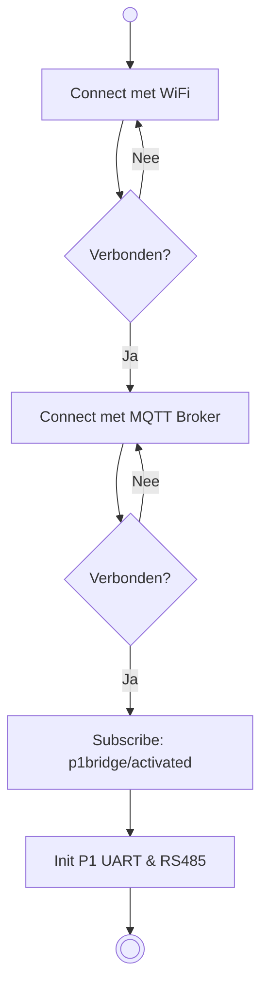
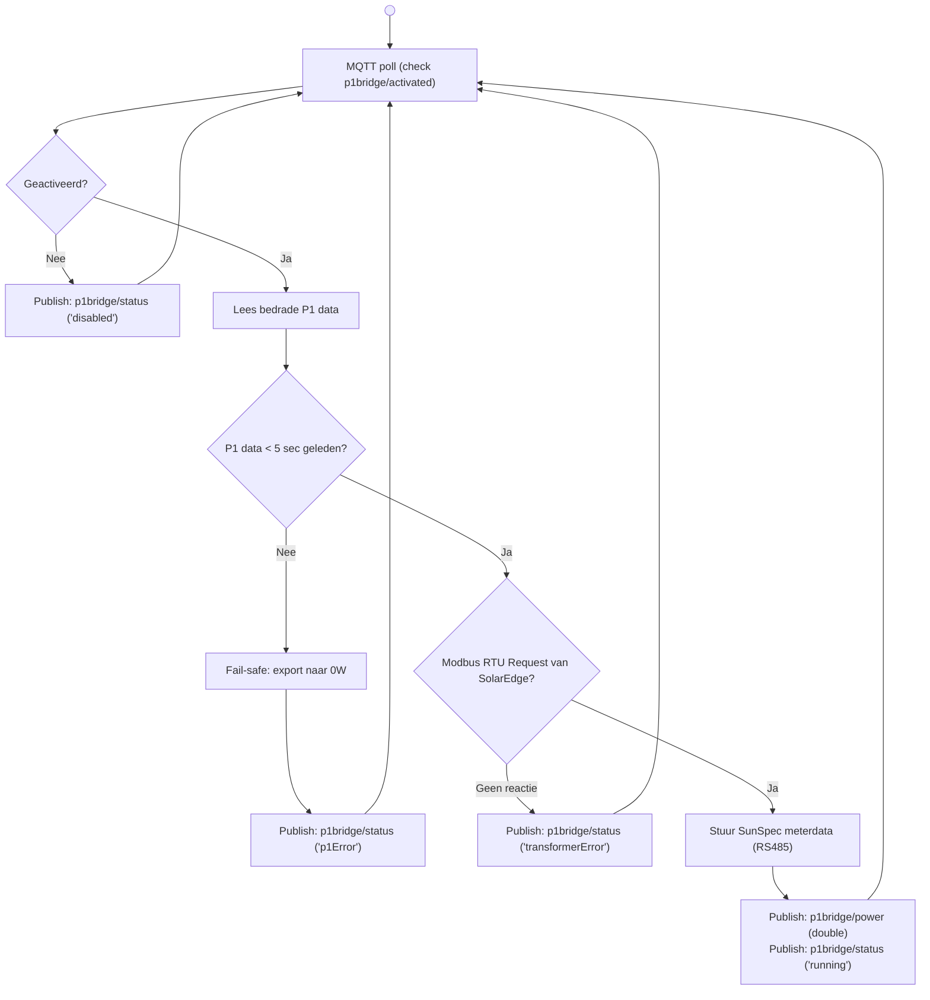

```mermaid
flowchart TD
    Start(( )) --> WiFi["Connect met WiFi"]
    WiFi --> WiFiOK{"Verbonden?"}
    WiFiOK -- "Nee" --> WiFi
    WiFiOK -- "Ja" --> MQTT["Connect met MQTT Broker"]
    MQTT --> MQTTOK{"Verbonden?"}
    MQTTOK -- "Nee" --> MQTT
    MQTTOK -- "Ja" --> Sub["Subscribe: p1bridge/activated"]
    Sub --> Init["Init P1 UART & RS485"]
    Init --> End((( )))
```

```mermaid
flowchart TD
    Start(( )) --> Poll["MQTT poll (check p1bridge/activated)"]
    Poll --> Active{"Geactiveerd?"}

    Active -- "Nee" --> PubDis["Publish: p1bridge/status ('disabled')"]
    PubDis --> Poll

    Active -- "Ja" --> ReadP1["Lees bedrade P1 data"]
    ReadP1 --> Watchdog{"P1 data < 5 sec geleden?"}

    Watchdog -- "Nee" --> FailSafe["Fail-safe: export naar 0W"]
    FailSafe --> PubP1Err["Publish: p1bridge/status ('p1Error')"]
    PubP1Err --> Poll

    Watchdog -- "Ja" --> ModReq{"Modbus RTU Request van SolarEdge?"}
    ModReq -- "Geen reactie" --> PubTrErr["Publish: p1bridge/status ('transformerError')"]
    PubTrErr --> Poll

    ModReq -- "Ja" --> SendSun["Stuur SunSpec meterdata (RS485)"]
    SendSun --> PubOk["Publish: p1bridge/power (double)<br/>Publish: p1bridge/status ('running')"]
    PubOk --> Poll
```
