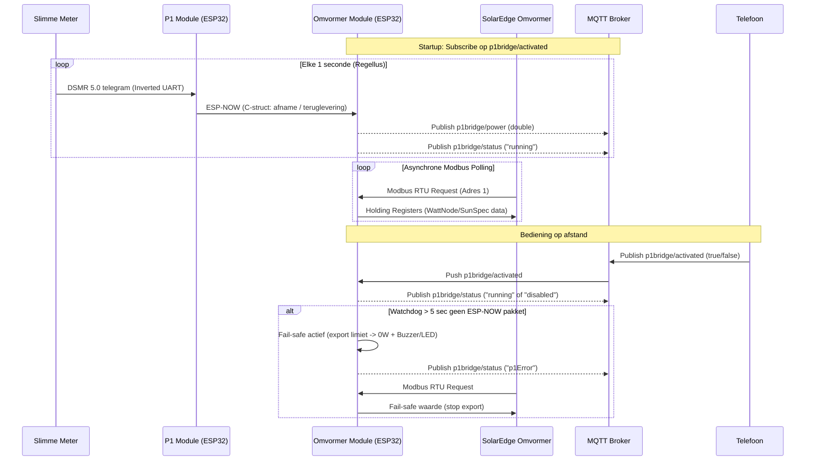

```mermaid
sequenceDiagram
    participant SM as Slimme Meter
    participant P1 as P1 Module (ESP32)
    participant MB as Omvormer Module (ESP32)
    participant SE as SolarEdge Omvormer
    participant MQTT as MQTT Broker
    participant App as Telefoon

    Note over MB,MQTT: Startup: Subscribe op p1bridge/activated

    loop Elke 1 seconde (Regellus)
        SM->>P1: DSMR 5.0 telegram (Inverted UART)
        P1->>MB: ESP-NOW (C-struct: afname / teruglevering)
        MB-->>MQTT: Publish p1bridge/power (double)
        MB-->>MQTT: Publish p1bridge/status ("running")
    end

    loop Asynchrone Modbus Polling
        SE->>MB: Modbus RTU Request (Adres 1)
        MB->>SE: Holding Registers (WattNode/SunSpec data)
    end

    Note over App,MB: Bediening op afstand
    App->>MQTT: Publish p1bridge/activated (true/false)
    MQTT->>MB: Push p1bridge/activated
    MB-->>MQTT: Publish p1bridge/status ("running" of "disabled")

    alt Watchdog > 5 sec geen ESP-NOW pakket
        MB->>MB: Fail-safe actief (export limiet -> 0W + Buzzer/LED)
        MB-->>MQTT: Publish p1bridge/status ("p1Error")
        SE->>MB: Modbus RTU Request
        MB->>SE: Fail-safe waarde (stop export)
    end
```
