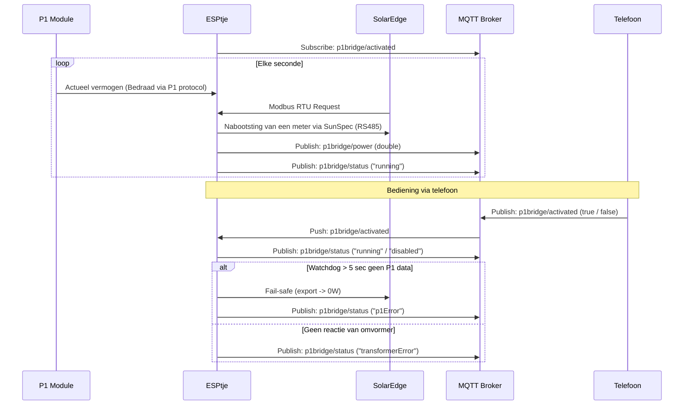

```mermaid
sequenceDiagram
    participant P1 as P1 Module
    participant MB as ESPtje
    participant SE as SolarEdge
    participant MQTT as MQTT Broker
    participant App as Telefoon

    MB->>MQTT: Subscribe: p1bridge/activated

    loop Elke seconde
        P1->>MB: Actueel vermogen (Bedraad via P1 protocol)
        SE->>MB: Modbus RTU Request
        MB->>SE: Nabootsting van een meter via SunSpec (RS485)
        MB->>MQTT: Publish: p1bridge/power (double)
        MB->>MQTT: Publish: p1bridge/status ("running")
    end

    Note over App,MB: Bediening via telefoon
    App->>MQTT: Publish: p1bridge/activated (true / false)
    MQTT->>MB: Push: p1bridge/activated
    MB->>MQTT: Publish: p1bridge/status ("running" / "disabled")

    alt Watchdog > 5 sec geen P1 data
        MB->>SE: Fail-safe (export -> 0W)
        MB->>MQTT: Publish: p1bridge/status ("p1Error")
    else Geen reactie van omvormer
        MB->>MQTT: Publish: p1bridge/status ("transformerError")
    end
```
